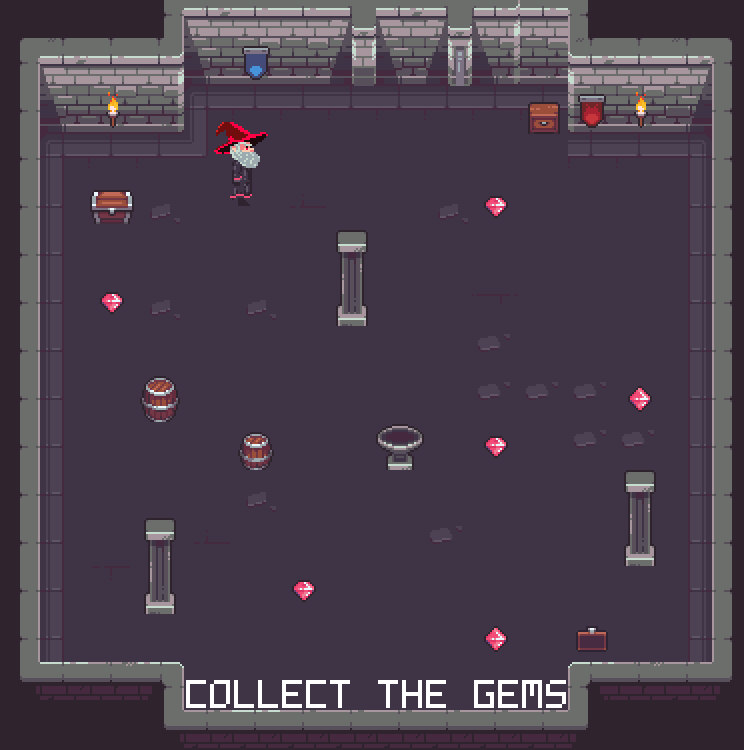

# Forgotten Runes Demo

This is a minimal example on how to use [Forgotten Runes](https://www.forgottenrunes.com/) sprites,
made for [RIVES Game Jam #2](https://itch.io/jam/rives2).
In the game you are a wizard that can collect gems,
the wizard can run faster and cast spells by using action keys Z/X.
It's not a complete game, just a small example to demonstrate how to use forgotten runes sprites.

You can play the demo in your browser [here](https://emulator.rives.io/#cartridge=https://raw.githubusercontent.com/edubart/cartridges/main/forgotten-runes-demo.sqfs).



## Artwork

It uses the 50x50 sprite sheet [wizard-spritesheet-53.png](wizard-spritesheet-53.png) from
[Adept Milo from the Shadow](https://www.forgottenrunes.com/lore/wizards/53/0)
wizard for the player.
Plus the 24x24 sprite sheet `tileset.png` from
[Free RPG Basic Tileset](https://pixel-poem.itch.io/free-rpg-tileset).

The sprite sheet colors are normalized to all the colors present in [palette.png](palette.png),
this palette was generated by listing all unique colors across many Forgotten Runes sprite sheets.

## Map

To make the map the [Tiled](https://www.mapeditor.org/) map editor is used to make a 16x16
tile map [map.tmx](map.tmx).

The map is exported as Lua file into [map.lua](map.lua) and then the small script
[map_conv.lua](map_conv.lua) converts the map into [map.h](map.h) used by the C source code.

If you edit the `map.tmx`, you must regenerate both `map.lua` and `map.h`,
you can regenerate by doing `make map.lua map.h`.

## Code

The entire game logic is contained in [forgotten-runes-demo.c](forgotten-runes-demo.c),
this file is commented so you can read as an example.
It contains a rudimentary collision detection system for walking the player across the map.

## Resolution

The game uses 384x384 resolution on a 16x16 map using 24x24 tiles.
I thought this is a resolution choice for games using Forgotten Runes wizard sprite sheets.
The target frame rate is set to 30 fps instead of 60 fps,
to compensate for the cost of rendering at a higher resolution (default RIV resolution is 256x256).

## Testing the cartridge

Having the [RIV emulator](https://rives.io/docs/riv/getting-started)
you can quickly test without needing to compile the cartridge with:

```sh
rivemu -workspace -exec riv-jit-c forgotten-runes-demo.c
```

## Compiling the cartridge

Having the [RIV SDK](https://rives.io/docs/riv/developing-cartridges#installing-the-riv-sdk)
installed, just do:

```sh
make
rivemu forgotten-runes-demo.sqfs
```
